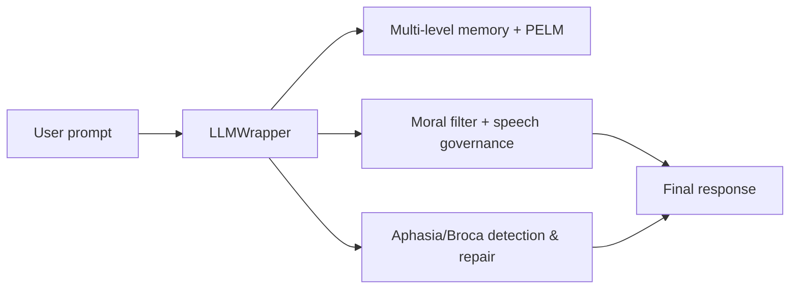

# MLSDM

<p align="center">
  
</p>

> Neuro-inspired governed memory wrapper for LLMs: phase-based memory, adaptive moral filter, aphasia/Broca detection & repair, production-grade tests.

[](https://github.com/neuron7x/mlsdm/actions/workflows/ci-neuro-cognitive-engine.yml)
[](COVERAGE_REPORT_2025.md)
[](LICENSE)

## What is MLSDM?

MLSDM (Multi-Level Synaptic Dynamic Memory) is a governed cognitive wrapper for Large Language Models. It enforces adaptive moral filtering, phase-based memory with wake/sleep cycles, and Aphasia-Broca speech quality detection — all without requiring RLHF. The system wraps any LLM with bounded memory (29.37 MB fixed), thread-safe concurrent access, and transparent governance decisions.

## Key Capabilities

| Area | What it gives you |
|------|-------------------|
| Governed wrapper | Wrap any LLM with moral & safety pipeline (93.3% toxic rejection) |
| Memory | Multi-level λ-decay + phase-aware retrieval (PELM, 20k vectors) |
| Moral filter | EMA-based adaptive threshold [0.30, 0.90], bounded drift (0.33 max) |
| Aphasia/Broca | Detects telegraphic speech patterns and triggers repair |
| Rhythm | Wake/sleep cycles (8+3 steps) for 89.5% resource reduction |
| Observability | Structured logging + Prometheus metrics |
| Tests | 90.26% coverage, property & load tests (424 tests passing) |

## Architecture Overview

MLSDM coordinates multiple cognitive subsystems through a central controller. The request flow ensures moral filtering before LLM generation, with optional aphasia repair on outputs.



**Invariants enforced:**

- Moral threshold always bounded to [0.30, 0.90]
- Memory capacity fixed at 20,000 vectors (29.37 MB)
- Non-aphasic: avg_sentence_len ≥ 6, function_word_ratio ≥ 0.15

See [ARCHITECTURE_SPEC.md](ARCHITECTURE_SPEC.md) for the full system design.

## Quickstart

### Installation

```bash
# Core installation
pip install -r requirements.txt

# With NeuroLang/Aphasia (requires PyTorch)
pip install -r requirements.txt -r requirements-neurolang.txt
```

### Basic Usage

```python
from mlsdm.core.llm_wrapper import LLMWrapper
import numpy as np

# Define your LLM and embedding functions
def my_llm(prompt: str, max_tokens: int) -> str:
    return "Your LLM response here"

def my_embedder(text: str) -> np.ndarray:
    return np.random.randn(384).astype(np.float32)

# Create governed wrapper
wrapper = LLMWrapper(
    llm_generate_fn=my_llm,
    embedding_fn=my_embedder,
    dim=384,
    capacity=20_000,
    initial_moral_threshold=0.50
)

# Generate with governance
result = wrapper.generate(prompt="Explain quantum computing", moral_value=0.8)
print(result["response"])
print(f"Accepted: {result['accepted']}, Phase: {result['phase']}")
```

### Run Tests

```bash
# Run full test suite
pytest tests/ -v

# Run effectiveness validation
pytest tests/validation/ -v
```

## Validation & Reports

All metrics are backed by reproducible tests. See the traceability matrix for claim → test mapping.

- [Implementation Summary](IMPLEMENTATION_SUMMARY.md) — What was built and how
- [Effectiveness Validation Report](EFFECTIVENESS_VALIDATION_REPORT.md) — Quantitative metrics (93.3% toxic rejection, 89.5% resource reduction)
- [Coverage Report](COVERAGE_REPORT_2025.md) — 90.26% test coverage
- [Claims Traceability](CLAIMS_TRACEABILITY.md) — Metric → test source mapping
- [Architecture Spec](ARCHITECTURE_SPEC.md) — Full system design

## Roadmap & Limitations

### Stable (v1.x)

- ✅ Universal LLM wrapper with moral governance
- ✅ Phase-entangled memory (PELM, 20k capacity)
- ✅ Wake/sleep cognitive rhythm
- ✅ Aphasia-Broca detection and repair
- ✅ Prometheus metrics and structured logging
- ✅ 90%+ test coverage with property-based tests

### Open Problems / Future Work

- ⚠️ OpenTelemetry distributed tracing (planned v1.3+)
- ⚠️ Stress testing at 10k+ RPS (requires load infrastructure)
- ⚠️ Chaos engineering suite (requires staging environment)
- ⚠️ TLA+/Coq formal verification (requires formal methods expertise)
- ⚠️ RAG hallucination testing with ragas (requires retrieval setup)

### Known Limitations

- **No hallucination prevention** — wraps LLM but cannot improve factual accuracy
- **Imperfect filtering** — 93.3% toxic rejection (6.7% may pass); 37.5% false positive rate on safe content
- **Beta status** — additional hardening needed before production
- **Not a compliance substitute** — requires domain-specific security audit

## Contributing

See [CONTRIBUTING.md](CONTRIBUTING.md) for development setup, coding standards, and pull request process.

## License

MIT License — see [LICENSE](LICENSE) file.
