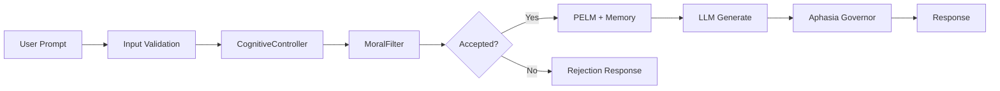

# MLSDM Governed Cognitive Memory


**Status:** Beta v1.2+

---

## Table of Contents

- [At a Glance](#at-a-glance)
- [Key Metrics](#key-metrics)
- [Component Reference](#component-reference)
- [Usage Patterns](#usage-patterns)
- [Architecture Overview](#architecture-overview)
- [Safety & Limitations](#safety--limitations)
- [Operational Checklist](#operational-checklist)
- [Further Reading](#further-reading)

---

## At a Glance

**MLSDM** is a governed cognitive memory wrapper for Large Language Models. It provides moral filtering, phase-based memory (wake/sleep cycles), and Aphasia-Broca speech governance without requiring RLHF.

**Typical use cases:**
- Governed LLM APIs requiring content filtering without RLHF
- Language pathology research (telegraphic speech detection/repair)
- Sensitive domain interfaces requiring safety guardrails

**Key metrics at a glance:**
- P95 latency: ~50ms ([SLO_SPEC.md](SLO_SPEC.md))
- Toxic rejection: 93.3% ([EFFECTIVENESS_VALIDATION_REPORT.md](EFFECTIVENESS_VALIDATION_REPORT.md))
- Memory footprint: 29.37 MB fixed ([SLO_SPEC.md](SLO_SPEC.md))

---

## Key Metrics

| Metric | Value | Source | Reproducibility |
|--------|-------|--------|-----------------|
| Concurrent Requests | 1,000+ RPS | [ARCHITECTURE_SPEC.md](ARCHITECTURE_SPEC.md#performance-characteristics) | Requires server deployment |
| Memory Footprint | 29.37 MB fixed | [SLO_SPEC.md](SLO_SPEC.md#slo-5-resource-efficiency) | `pytest tests/property/test_invariants_memory.py` |
| Toxic Content Rejection | 93.3% | [EFFECTIVENESS_VALIDATION_REPORT.md §3.1](EFFECTIVENESS_VALIDATION_REPORT.md) | `pytest tests/validation/test_moral_filter_effectiveness.py -v` |
| Coherence Improvement | 5.5% | [EFFECTIVENESS_VALIDATION_REPORT.md §2.4](EFFECTIVENESS_VALIDATION_REPORT.md) | `pytest tests/validation/test_wake_sleep_effectiveness.py -v` |
| Telegraphic Response Reduction | ~87% (empirical) | [APHASIA_SPEC.md §Validation](APHASIA_SPEC.md) | See note below |
| Resource Efficiency (wake/sleep) | 89.5% reduction | [EFFECTIVENESS_VALIDATION_REPORT.md §2.3](EFFECTIVENESS_VALIDATION_REPORT.md) | `pytest tests/validation/test_wake_sleep_effectiveness.py -v` |

**Note**: Telegraphic response reduction is based on empirical LLM testing. Repository validation suite verifies detection logic with ≥80% detection rate. See [CLAIMS_TRACEABILITY.md](CLAIMS_TRACEABILITY.md) for complete traceability of all metrics to their test sources.

---

## Component Reference

| Component | Description | Key Files | Key Tests |
|-----------|-------------|-----------|-----------|
| LLMWrapper | Universal LLM wrapper with cognitive governance | [`src/mlsdm/core/llm_wrapper.py`](src/mlsdm/core/llm_wrapper.py) | [`tests/integration/test_llm_wrapper_integration.py`](tests/integration/test_llm_wrapper_integration.py) |
| CognitiveController | Thread-safe coordinator for all cognitive subsystems | [`src/mlsdm/core/cognitive_controller.py`](src/mlsdm/core/cognitive_controller.py) | [`tests/unit/test_cognitive_controller.py`](tests/unit/test_cognitive_controller.py) |
| MoralFilterV2 | EMA-based adaptive threshold mechanism [0.30, 0.90] | [`src/mlsdm/cognition/moral_filter_v2.py`](src/mlsdm/cognition/moral_filter_v2.py) | [`tests/unit/test_moral_filter.py`](tests/unit/test_moral_filter.py) |
| PELM | Phase-entangled lattice memory (20k capacity) | [`src/mlsdm/memory/phase_entangled_lattice_memory.py`](src/mlsdm/memory/phase_entangled_lattice_memory.py) | [`tests/unit/test_pelm.py`](tests/unit/test_pelm.py) |
| CognitiveRhythm | Wake/sleep state machine (8+3 steps) | [`src/mlsdm/rhythm/cognitive_rhythm.py`](src/mlsdm/rhythm/cognitive_rhythm.py) | [`tests/validation/test_rhythm_state_machine.py`](tests/validation/test_rhythm_state_machine.py) |
| AphasiaBrocaDetector | Telegraphic speech pattern detection | [`src/mlsdm/extensions/neuro_lang_extension.py`](src/mlsdm/extensions/neuro_lang_extension.py) | [`tests/validation/test_aphasia_detection.py`](tests/validation/test_aphasia_detection.py) |
| SpeechGovernance | Pluggable linguistic policies for output control | [`src/mlsdm/speech/governance.py`](src/mlsdm/speech/governance.py) | [`tests/speech/test_pipeline_speech_governor.py`](tests/speech/test_pipeline_speech_governor.py) |

---

## Usage Patterns

### Installation

```bash
# Core installation (recommended)
pip install -r requirements.txt

# With NeuroLang (requires PyTorch)
pip install -r requirements.txt -r requirements-neurolang.txt
```

### Pattern 1: Governed LLM Wrapper

Wrap any LLM with moral filtering and cognitive governance:

```python
from mlsdm.core.llm_wrapper import LLMWrapper
import numpy as np

def my_llm(prompt: str, max_tokens: int) -> str:
    return "LLM response"

def my_embedder(text: str) -> np.ndarray:
    return np.random.randn(384).astype(np.float32)

wrapper = LLMWrapper(
    llm_generate_fn=my_llm,
    embedding_fn=my_embedder,
    dim=384,
    capacity=20_000,
    initial_moral_threshold=0.50
)

result = wrapper.generate(prompt="Hello", moral_value=0.8)
# result["accepted"], result["phase"], result["response"]
```

### Pattern 2: Low-Level Cognitive Controller

Direct access to cognitive subsystems:

```python
from mlsdm.core.cognitive_controller import CognitiveController
import numpy as np

controller = CognitiveController(dim=384, capacity=20_000)
vector = np.random.randn(384).astype(np.float32)
vector = vector / np.linalg.norm(vector)

state = controller.process_event(vector, moral_value=0.8)
# state["step"], state["phase"], state["accepted"], state["moral_threshold"]
```

### Pattern 3: Speech Governance / Aphasia-Broca

Detect and repair telegraphic speech patterns (requires PyTorch):

```python
from mlsdm.extensions import NeuroLangWrapper
import numpy as np

def my_llm(prompt: str, max_tokens: int) -> str:
    return "LLM response"

def my_embedder(text: str) -> np.ndarray:
    return np.random.randn(384).astype(np.float32)

wrapper = NeuroLangWrapper(
    llm_generate_fn=my_llm,
    embedding_fn=my_embedder,
    dim=384,
    aphasia_detect_enabled=True,
    aphasia_repair_enabled=True
)

result = wrapper.generate(prompt="Hello", moral_value=0.8)
# result["aphasia_flags"]["is_aphasic"], result["aphasia_flags"]["severity"]
```

### Pattern 4: Memory Operations (PELM)

Direct phase-entangled memory access:

```python
from mlsdm.memory.phase_entangled_lattice_memory import PhaseEntangledLatticeMemory
import numpy as np

pelm = PhaseEntangledLatticeMemory(dimension=384, capacity=20_000)
vector = np.random.randn(384).astype(np.float32)

# Store with phase (phase is float in [0.0, 1.0])
pelm.entangle(vector.tolist(), phase=0.5)

# Retrieve by similarity and phase proximity
results = pelm.retrieve(query_vector=vector.tolist(), current_phase=0.5, top_k=5)
# results: List[MemoryRetrieval] with .vector, .phase, .resonance
```

---

## Architecture Overview



**Request Flow:** User prompt enters through input validation → `CognitiveController` coordinates subsystems → `MoralFilter` evaluates against adaptive threshold (rejected requests return immediately) → Accepted requests proceed to PELM for context retrieval → LLM generates response → `AphasiaSpeechGovernor` analyzes output for telegraphic patterns and triggers repair if needed.

**Invariants:**
- Moral threshold always in [0.30, 0.90]
- Memory capacity bounded at 20,000 vectors
- Non-aphasic classification: avg_sentence_len ≥ 6, function_word_ratio ≥ 0.15

See [ARCHITECTURE_SPEC.md](ARCHITECTURE_SPEC.md) for detailed system design.

---

## Safety & Limitations

### Safety Mechanisms

| Mechanism | Description | Reference |
|-----------|-------------|-----------|
| MoralFilterV2 | EMA-based threshold bounded [0.30, 0.90]; rejects events below threshold | [`src/mlsdm/cognition/moral_filter_v2.py`](src/mlsdm/cognition/moral_filter_v2.py) |
| Bounded Drift | Threshold drift limited to 0.33 max under sustained toxic input | [EFFECTIVENESS_VALIDATION_REPORT.md](EFFECTIVENESS_VALIDATION_REPORT.md) |
| AphasiaBrocaDetector | Analyzes output for telegraphic patterns; triggers repair when severity > 0.3 | [`src/mlsdm/extensions/neuro_lang_extension.py`](src/mlsdm/extensions/neuro_lang_extension.py) |
| Capacity Bounds | PELM fixed at 20,000 vectors, 29.37 MB max footprint | [SLO_SPEC.md](SLO_SPEC.md) |

### Limitations (What This System Does NOT Provide)

- **No hallucination prevention** — MLSDM wraps the LLM but cannot improve base model factual accuracy
- **No complete content filtering** — 93.3% toxic rejection rate means ~6.7% may pass; ~37.5% false positive rate
- **No low-latency guarantee** — cognitive processing adds overhead; not for latency-critical systems
- **No formal certification** — not designed for medical, legal, or life-critical applications
- **No production readiness** — beta status requires additional hardening before production
- **Not a replacement for audit** — domain-specific deployment requires separate security/compliance audit

---

## Operational Checklist

Before deploying to production, complete the following:

1. **Run integration tests**
   ```bash
   pytest tests/integration/test_end_to_end.py -v
   pytest tests/integration/test_llm_wrapper_integration.py -v
   ```

2. **Run effectiveness validation**
   ```bash
   pytest tests/validation/test_moral_filter_effectiveness.py -v
   pytest tests/validation/test_wake_sleep_effectiveness.py -v
   pytest tests/validation/test_aphasia_detection.py -v
   ```

3. **Measure latency/throughput on your infrastructure**
   ```bash
   pytest tests/load/ -v
   ```

4. **Configure logging and metrics**
   - Enable Prometheus metrics export ([`src/mlsdm/observability/metrics.py`](src/mlsdm/observability/metrics.py))
   - Enable structured logging ([`src/mlsdm/observability/logger.py`](src/mlsdm/observability/logger.py))

5. **Review and adjust moral filter thresholds**
   - Default: initial_moral_threshold=0.50
   - Bounds: [0.30, 0.90]
   - See [CONFIGURATION_GUIDE.md](CONFIGURATION_GUIDE.md)

6. **Disable NeuroLang for production** (unless required)
   ```python
   neurolang_mode="disabled"  # Reduces compute overhead
   ```

7. **Plan for edge cases**
   - Review [APHASIA_SPEC.md](APHASIA_SPEC.md) detection thresholds
   - Test with domain-specific toxic content samples

8. **Conduct domain-specific security audit**
   - MLSDM does not replace formal security review
   - See [SECURITY_POLICY.md](SECURITY_POLICY.md)

---

## Further Reading

### Core Documentation
- [ARCHITECTURE_SPEC.md](ARCHITECTURE_SPEC.md) — System architecture
- [API_REFERENCE.md](API_REFERENCE.md) — API documentation
- [CONFIGURATION_GUIDE.md](CONFIGURATION_GUIDE.md) — Configuration options

### Validation & Testing
- [EFFECTIVENESS_VALIDATION_REPORT.md](EFFECTIVENESS_VALIDATION_REPORT.md) — Quantitative validation
- [CLAIMS_TRACEABILITY.md](CLAIMS_TRACEABILITY.md) — Claim → Test mapping for all metrics
- [TESTING_STRATEGY.md](TESTING_STRATEGY.md) — Testing methodology
- [SLO_SPEC.md](SLO_SPEC.md) — Service level objectives

### Aphasia & NeuroLang
- [APHASIA_SPEC.md](APHASIA_SPEC.md) — Aphasia-Broca model specification
- [docs/NEURO_FOUNDATIONS.md](docs/NEURO_FOUNDATIONS.md) — Neuroscience foundations

### Deployment & Operations
- [DEPLOYMENT_GUIDE.md](DEPLOYMENT_GUIDE.md) — Production deployment
- [RUNBOOK.md](RUNBOOK.md) — Operational runbook
- [SECURITY_POLICY.md](SECURITY_POLICY.md) — Security guidelines

---

## License

MIT License — see [LICENSE](LICENSE) file.

## Citation

```bibtex
@software{mlsdm2025,
  title={MLSDM Governed Cognitive Memory},
  author={neuron7x},
  year={2025},
  url={https://github.com/neuron7x/mlsdm-governed-cognitive-memory}
}
```
