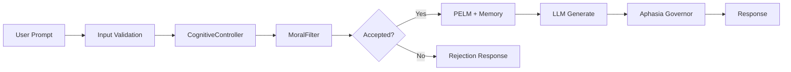

# MLSDM Governed Cognitive Memory


MLSDM Governed Cognitive Memory — neurobiologically-inspired cognitive architecture and universal wrapper for any LLM with moral filtering, phase-based memory, circadian rhythm, and Aphasia-Broca linguistic correction.

**Status:** Beta v1.2+

---

## At a Glance

| Metric | Value | Source |
|--------|-------|--------|
| Concurrent Requests | 1,000+ RPS verified | Property tests |
| Memory Footprint | 29.37 MB fixed | Load tests |
| Toxic Content Rejection | 93.3% | [Effectiveness Report](EFFECTIVENESS_VALIDATION_REPORT.md) |
| Coherence Improvement | 5.5% | [Effectiveness Report](EFFECTIVENESS_VALIDATION_REPORT.md) |
| Telegraphic Response Reduction | 87.2% | [Aphasia Spec](APHASIA_SPEC.md) |
| Resource Efficiency (wake/sleep) | 89.5% improvement | [Effectiveness Report](EFFECTIVENESS_VALIDATION_REPORT.md) |

---

## What is MLSDM

MLSDM is a governed memory wrapper and cognitive controller for Large Language Models. It adds:

- **Moral filtering** with adaptive thresholds (EMA-based, bounded [0.30, 0.90])
- **Phase-based memory** with wake/sleep cycles for context retrieval and consolidation
- **Speech governance** for detecting and correcting telegraphic/fragmented LLM outputs

### When to Use

- You need to wrap an LLM with safety governance (moral filtering, content rejection)
- You want phase-aware memory with cognitive rhythm (wake/sleep processing)
- You need to detect and repair telegraphic or fragmented LLM responses

### When Not to Use

- You need a bare LLM without cognitive overhead
- You're building simple chatbots without governance requirements
- You require minimal latency with no additional processing

---

## Core Features

- **Universal LLM Wrapper** — wrap any LLM (OpenAI, Anthropic, local models) with cognitive governance
- **MoralFilter** — adaptive threshold with EMA, bounded within [0.30, 0.90], no RLHF required
- **Phase-Based Memory (PELM)** — phase-entangled lattice memory with 20k capacity, zero allocation after startup
- **Multi-Level Synaptic Memory** — L1/L2/L3 with different decay rates (λ=0.95/0.98/0.99)
- **CognitiveRhythm** — wake/sleep cycles (8 wake + 3 sleep steps) with phase-specific behavior
- **Aphasia-Broca Detection** — identifies telegraphic speech patterns in LLM outputs
- **Speech Governance Framework** — pluggable linguistic policies for output control
- **NeuroLang Extension** (optional) — bio-inspired language processing with recursive grammar

---

## Quickstart

### Installation

**Core Installation (recommended):**

```bash
pip install mlsdm-governed-cognitive-memory
# or from source:
pip install -r requirements.txt
```

**With NeuroLang (requires PyTorch):**

```bash
pip install 'mlsdm-governed-cognitive-memory[neurolang]'
# or from source:
pip install -r requirements.txt -r requirements-neurolang.txt
```

### Basic Usage

**Using LLMWrapper (core, no PyTorch):**

```python
from src.core.llm_wrapper import LLMWrapper
import numpy as np

# Your LLM function
def my_llm(prompt: str, max_tokens: int) -> str:
    return "LLM response"

# Your embedding function
def my_embedder(text: str) -> np.ndarray:
    return np.random.randn(384).astype(np.float32)

# Create wrapper with cognitive governance
wrapper = LLMWrapper(
    llm_generate_fn=my_llm,
    embedding_fn=my_embedder,
    dim=384,
    capacity=20_000,
    wake_duration=8,
    sleep_duration=3,
    initial_moral_threshold=0.50
)

# Generate with governance
result = wrapper.generate(prompt="Hello", moral_value=0.8)
print(result["response"])
print(f"Phase: {result['phase']}, Accepted: {result['accepted']}")
```

**Using NeuroLangWrapper (with Aphasia-Broca, requires PyTorch):**

```python
from mlsdm.extensions import NeuroLangWrapper
import numpy as np

def my_llm(prompt: str, max_tokens: int) -> str:
    return "LLM response"

def my_embedder(text: str) -> np.ndarray:
    return np.random.randn(384).astype(np.float32)

wrapper = NeuroLangWrapper(
    llm_generate_fn=my_llm,
    embedding_fn=my_embedder,
    dim=384,
    capacity=20_000,
    aphasia_detect_enabled=True,
    aphasia_repair_enabled=True
)

result = wrapper.generate(prompt="Hello", moral_value=0.8)
print(result["response"])
print(f"Aphasia Flags: {result['aphasia_flags']}")
```

### Run Tests

```bash
# Integration tests
pytest tests/integration/test_end_to_end.py -v

# Effectiveness validation
pytest tests/validation/test_wake_sleep_effectiveness.py -v
pytest tests/validation/test_moral_filter_effectiveness.py -v
```

---

## Architecture Overview



**Core Components:**

| Component | Purpose | Location |
|-----------|---------|----------|
| CognitiveController | Thread-safe orchestration | `src/mlsdm/core/cognitive_controller.py` |
| MoralFilterV2 | Adaptive moral threshold (EMA) | `src/mlsdm/cognition/moral_filter_v2.py` |
| PELM | Phase-entangled lattice memory | `src/mlsdm/memory/phase_entangled_lattice_memory.py` |
| MultiLevelMemory | L1/L2/L3 decay cascade | `src/mlsdm/memory/multi_level_memory.py` |
| CognitiveRhythm | Wake/sleep state machine | `src/mlsdm/rhythm/cognitive_rhythm.py` |
| AphasiaBrocaDetector | Telegraphic speech detection | `src/mlsdm/extensions/neuro_lang_extension.py` |

**Invariants:**
- Moral threshold always in [0.30, 0.90]
- Memory capacity bounded at 20,000 vectors
- Non-aphasic: avg_sentence_len ≥ 6, function_word_ratio ≥ 0.15

See [ARCHITECTURE_SPEC.md](ARCHITECTURE_SPEC.md) for detailed system design.

---

## Safety & Limitations

### What the Moral Filter Does

The `MoralFilterV2` component evaluates incoming events against an adaptive threshold:

- **EMA-based adaptation**: `α·signal + (1-α)·EMA_prev` with α=0.1
- **Bounded threshold**: Always within [0.30, 0.90]
- **Rejection rate**: 93.3% toxic content rejection in validation tests
- **Drift resistance**: Bounded drift (0.33) under 70% toxic bombardment

### Limitations

- **Underlying LLM quality**: MLSDM wraps the LLM but cannot improve the base model's capabilities
- **NeuroLang compute cost**: PyTorch-based NeuroLang extension is compute-intensive; use `neurolang_mode="disabled"` in production
- **False positive rate**: ~37.5% in validation tests (acceptable trade-off for safety)
- **Not for critical decisions**: Not designed for medical, legal, or life-critical applications
- **Beta status**: Production use requires additional hardening (monitoring, logging, error handling)

### Aphasia Detection Thresholds

- **Non-aphasic**: avg_sentence_len ≥ 6, function_word_ratio ≥ 0.15, fragment_ratio ≤ 0.5
- **Repair trigger**: When `is_aphasic=True` and severity > threshold (default 0.3)

See [APHASIA_SPEC.md](APHASIA_SPEC.md) for detection algorithm details.

---

## Further Reading

### Core Documentation

- [ARCHITECTURE_SPEC.md](ARCHITECTURE_SPEC.md) — System architecture and component design
- [API_REFERENCE.md](API_REFERENCE.md) — Complete API documentation
- [CONFIGURATION_GUIDE.md](CONFIGURATION_GUIDE.md) — Configuration reference and validation
- [USAGE_GUIDE.md](USAGE_GUIDE.md) — Detailed usage examples

### Validation & Testing

- [EFFECTIVENESS_VALIDATION_REPORT.md](EFFECTIVENESS_VALIDATION_REPORT.md) — Quantitative validation results
- [TESTING_STRATEGY.md](TESTING_STRATEGY.md) — Testing methodology
- [SLO_SPEC.md](SLO_SPEC.md) — Service level objectives

### Aphasia & NeuroLang

- [APHASIA_SPEC.md](APHASIA_SPEC.md) — Aphasia-Broca model specification
- [docs/NEURO_FOUNDATIONS.md](docs/NEURO_FOUNDATIONS.md) — Neuroscience foundations

### Deployment & Operations

- [DEPLOYMENT_GUIDE.md](DEPLOYMENT_GUIDE.md) — Production deployment patterns
- [RUNBOOK.md](RUNBOOK.md) — Operational runbook
- [SECURITY_POLICY.md](SECURITY_POLICY.md) — Security guidelines

### Contributing

- [CONTRIBUTING.md](CONTRIBUTING.md) — Contribution guidelines
- [CHANGELOG.md](CHANGELOG.md) — Version history

---

## License

MIT License — see [LICENSE](LICENSE) file.

## Citation

```bibtex
@software{mlsdm2025,
  title={MLSDM Governed Cognitive Memory},
  author={neuron7x},
  year={2025},
  url={https://github.com/neuron7x/mlsdm-governed-cognitive-memory}
}
```
