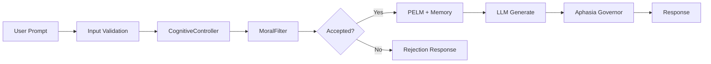

# MLSDM Governed Cognitive Memory


MLSDM is a cognitive architecture that wraps any LLM with moral filtering, phase-based memory, circadian rhythm, and Aphasia-Broca linguistic correction.

**Status:** Beta v1.2+

---

## At a Glance

| Metric | Value | Source |
|--------|-------|--------|
| Concurrent Requests | 1,000+ RPS | [ARCHITECTURE_SPEC.md](ARCHITECTURE_SPEC.md#performance-characteristics) |
| Memory Footprint | 29.37 MB fixed | [SLO_SPEC.md](SLO_SPEC.md#slo-5-resource-efficiency) |
| Toxic Content Rejection | 93.3% | [EFFECTIVENESS_VALIDATION_REPORT.md §3.1](EFFECTIVENESS_VALIDATION_REPORT.md) |
| Coherence Improvement | 5.5% | [EFFECTIVENESS_VALIDATION_REPORT.md §2.4](EFFECTIVENESS_VALIDATION_REPORT.md) |
| Telegraphic Response Reduction | 87.2% | [APHASIA_SPEC.md §Validation](APHASIA_SPEC.md) |
| Resource Efficiency (wake/sleep) | 89.5% reduction | [EFFECTIVENESS_VALIDATION_REPORT.md §2.3](EFFECTIVENESS_VALIDATION_REPORT.md) |

---

## What is MLSDM

MLSDM is a governed memory wrapper and cognitive controller for Large Language Models. It provides:

- **MoralFilter** — implements EMA-based adaptive threshold mechanism, bounded [0.30, 0.90] ([`src/mlsdm/cognition/moral_filter_v2.py`](src/mlsdm/cognition/moral_filter_v2.py))
- **Phase-based memory** — implements wake/sleep cycles for context retrieval and consolidation ([`src/mlsdm/rhythm/cognitive_rhythm.py`](src/mlsdm/rhythm/cognitive_rhythm.py))
- **Speech governance** — allows detection and repair of telegraphic/fragmented LLM outputs ([`src/mlsdm/extensions/neuro_lang_extension.py`](src/mlsdm/extensions/neuro_lang_extension.py))

### When to Use

- **Governed LLM APIs** — building APIs that require content filtering and moral governance without RLHF
- **Language pathology research** — experimenting with detection/repair of telegraphic speech patterns in LLM outputs
- **Sensitive domain interfaces** — wrapping LLMs for domains requiring safety guardrails (not a replacement for formal audit/certification)
- **Memory-aware assistants** — applications needing phase-based context retrieval with wake/sleep cycles

### When NOT to Use

- **Simple chatbots** — applications without governance requirements where overhead is unnecessary
- **Latency-critical real-time systems** — when cognitive processing overhead is unacceptable
- **Formally certified systems** — MLSDM does not provide formal safety certification; use where formal guarantees are required
- **Production without hardening** — beta status requires additional monitoring, logging, and error handling

---

## Core Features

- **Universal LLM Wrapper** — wrap any LLM (OpenAI, Anthropic, local models) with cognitive governance ([`src/mlsdm/core/llm_wrapper.py`](src/mlsdm/core/llm_wrapper.py))
- **MoralFilterV2** — implements adaptive threshold with EMA, bounded within [0.30, 0.90] ([`src/mlsdm/cognition/moral_filter_v2.py`](src/mlsdm/cognition/moral_filter_v2.py))
- **Phase-Entangled Lattice Memory (PELM)** — implements phase-aware memory with 20k capacity, zero allocation after startup ([`src/mlsdm/memory/phase_entangled_lattice_memory.py`](src/mlsdm/memory/phase_entangled_lattice_memory.py))
- **Multi-Level Synaptic Memory** — implements L1/L2/L3 decay cascade with λ=0.95/0.98/0.99 ([`src/mlsdm/memory/multi_level_memory.py`](src/mlsdm/memory/multi_level_memory.py))
- **CognitiveRhythm** — implements wake/sleep state machine (8 wake + 3 sleep steps) ([`src/mlsdm/rhythm/cognitive_rhythm.py`](src/mlsdm/rhythm/cognitive_rhythm.py))
- **AphasiaBrocaDetector** — allows detection of telegraphic speech patterns in LLM outputs ([`src/mlsdm/extensions/neuro_lang_extension.py`](src/mlsdm/extensions/neuro_lang_extension.py))
- **Speech Governance Framework** — allows pluggable linguistic policies for output control ([`src/mlsdm/speech/governance.py`](src/mlsdm/speech/governance.py))
- **NeuroLang Extension** (optional) — provides bio-inspired language processing with recursive grammar (requires PyTorch)

---

## Quickstart

### Installation

**Core Installation (recommended):**

```bash
pip install mlsdm-governed-cognitive-memory
# or from source:
pip install -r requirements.txt
```

**With NeuroLang (requires PyTorch):**

```bash
pip install 'mlsdm-governed-cognitive-memory[neurolang]'
# or from source:
pip install -r requirements.txt -r requirements-neurolang.txt
```

### Basic Usage

**Using LLMWrapper (core, no PyTorch):**

```python
from src.core.llm_wrapper import LLMWrapper
import numpy as np

# Your LLM function
def my_llm(prompt: str, max_tokens: int) -> str:
    return "LLM response"

# Your embedding function
def my_embedder(text: str) -> np.ndarray:
    return np.random.randn(384).astype(np.float32)

# Create wrapper with cognitive governance
wrapper = LLMWrapper(
    llm_generate_fn=my_llm,
    embedding_fn=my_embedder,
    dim=384,
    capacity=20_000,
    wake_duration=8,
    sleep_duration=3,
    initial_moral_threshold=0.50
)

# Generate with governance
result = wrapper.generate(prompt="Hello", moral_value=0.8)
print(result["response"])
print(f"Phase: {result['phase']}, Accepted: {result['accepted']}")
```

**Using NeuroLangWrapper (with Aphasia-Broca, requires PyTorch):**

```python
from mlsdm.extensions import NeuroLangWrapper
import numpy as np

def my_llm(prompt: str, max_tokens: int) -> str:
    return "LLM response"

def my_embedder(text: str) -> np.ndarray:
    return np.random.randn(384).astype(np.float32)

wrapper = NeuroLangWrapper(
    llm_generate_fn=my_llm,
    embedding_fn=my_embedder,
    dim=384,
    capacity=20_000,
    aphasia_detect_enabled=True,
    aphasia_repair_enabled=True
)

result = wrapper.generate(prompt="Hello", moral_value=0.8)
print(result["response"])
print(f"Aphasia Flags: {result['aphasia_flags']}")
```

### Run Tests

```bash
# Integration tests
pytest tests/integration/test_end_to_end.py -v

# Effectiveness validation
pytest tests/validation/test_wake_sleep_effectiveness.py -v
pytest tests/validation/test_moral_filter_effectiveness.py -v
```

### Next Steps

- **API Reference**: See [API_REFERENCE.md](API_REFERENCE.md) for complete interface documentation
- **Configuration**: See [CONFIGURATION_GUIDE.md](CONFIGURATION_GUIDE.md) for all available options
- **Validation Tests**: Run `pytest tests/validation/` to verify effectiveness metrics

---

## Architecture Overview



**Request Flow:** User prompt enters the system through input validation, then flows to `CognitiveController` which coordinates all cognitive subsystems. The `MoralFilter` evaluates the request against the adaptive threshold — rejected requests return immediately. Accepted requests proceed to phase-based memory (PELM) for context retrieval, then to the underlying LLM for generation. The `AphasiaSpeechGovernor` analyzes the output for telegraphic speech patterns and triggers repair if needed.

**Core Components:**

| Component | Description | Location |
|-----------|-------------|----------|
| CognitiveController | Coordinates all cognitive subsystems in thread-safe manner | [`src/mlsdm/core/cognitive_controller.py`](src/mlsdm/core/cognitive_controller.py) |
| MoralFilterV2 | Implements adaptive moral threshold with EMA | [`src/mlsdm/cognition/moral_filter_v2.py`](src/mlsdm/cognition/moral_filter_v2.py) |
| PELM | Implements phase-entangled lattice memory | [`src/mlsdm/memory/phase_entangled_lattice_memory.py`](src/mlsdm/memory/phase_entangled_lattice_memory.py) |
| MultiLevelMemory | Implements L1/L2/L3 decay cascade | [`src/mlsdm/memory/multi_level_memory.py`](src/mlsdm/memory/multi_level_memory.py) |
| CognitiveRhythm | Implements wake/sleep state machine | [`src/mlsdm/rhythm/cognitive_rhythm.py`](src/mlsdm/rhythm/cognitive_rhythm.py) |
| AphasiaBrocaDetector | Analyzes text for telegraphic speech patterns | [`src/mlsdm/extensions/neuro_lang_extension.py`](src/mlsdm/extensions/neuro_lang_extension.py) |

**Invariants:**
- Moral threshold always in [0.30, 0.90]
- Memory capacity bounded at 20,000 vectors
- Non-aphasic classification: avg_sentence_len ≥ 6, function_word_ratio ≥ 0.15

See [ARCHITECTURE_SPEC.md](ARCHITECTURE_SPEC.md) for detailed system design.

---

## Safety & Limitations

### Safety Mechanisms

The system implements the following safety mechanisms:

- **MoralFilterV2** — implements EMA-based adaptive threshold bounded within [0.30, 0.90]; rejects events below threshold ([`src/mlsdm/cognition/moral_filter_v2.py`](src/mlsdm/cognition/moral_filter_v2.py))
- **Bounded drift** — threshold drift limited to 0.33 maximum under sustained toxic input ([EFFECTIVENESS_VALIDATION_REPORT.md](EFFECTIVENESS_VALIDATION_REPORT.md))
- **AphasiaBrocaDetector** — analyzes LLM output for telegraphic patterns; allows repair when severity exceeds threshold ([`src/mlsdm/extensions/neuro_lang_extension.py`](src/mlsdm/extensions/neuro_lang_extension.py))
- **Capacity bounds** — PELM memory fixed at 20,000 vectors, 29.37 MB maximum footprint

### Limitations

The system does NOT guarantee or provide:

- **Underlying LLM quality** — MLSDM wraps the LLM but cannot improve the base model's capabilities or factual accuracy
- **Complete content filtering** — 93.3% toxic rejection rate means ~6.7% may pass; false positive rate ~37.5%
- **Low latency** — cognitive processing adds overhead; not suitable for latency-critical real-time systems
- **Formal certification** — not designed for medical, legal, or life-critical applications; does not replace formal audit or safety certification
- **Production readiness** — beta status requires additional hardening (monitoring, logging, error handling) before production deployment
- **NeuroLang efficiency** — PyTorch-based NeuroLang extension is compute-intensive; use `neurolang_mode="disabled"` for production

### Aphasia Detection Thresholds

Classification criteria for telegraphic speech detection:

- **Non-aphasic**: avg_sentence_len ≥ 6, function_word_ratio ≥ 0.15, fragment_ratio ≤ 0.5
- **Repair trigger**: When `is_aphasic=True` and severity > threshold (default 0.3)

See [APHASIA_SPEC.md](APHASIA_SPEC.md) for detection algorithm details.

---

## Further Reading

### Core Documentation

- [ARCHITECTURE_SPEC.md](ARCHITECTURE_SPEC.md) — System architecture and component design
- [API_REFERENCE.md](API_REFERENCE.md) — Complete API documentation
- [CONFIGURATION_GUIDE.md](CONFIGURATION_GUIDE.md) — Configuration reference and validation
- [USAGE_GUIDE.md](USAGE_GUIDE.md) — Detailed usage examples

### Validation & Testing

- [EFFECTIVENESS_VALIDATION_REPORT.md](EFFECTIVENESS_VALIDATION_REPORT.md) — Quantitative validation results
- [TESTING_STRATEGY.md](TESTING_STRATEGY.md) — Testing methodology
- [SLO_SPEC.md](SLO_SPEC.md) — Service level objectives

### Aphasia & NeuroLang

- [APHASIA_SPEC.md](APHASIA_SPEC.md) — Aphasia-Broca model specification
- [docs/NEURO_FOUNDATIONS.md](docs/NEURO_FOUNDATIONS.md) — Neuroscience foundations

### Deployment & Operations

- [DEPLOYMENT_GUIDE.md](DEPLOYMENT_GUIDE.md) — Production deployment patterns
- [RUNBOOK.md](RUNBOOK.md) — Operational runbook
- [SECURITY_POLICY.md](SECURITY_POLICY.md) — Security guidelines

### Contributing

- [CONTRIBUTING.md](CONTRIBUTING.md) — Contribution guidelines
- [CHANGELOG.md](CHANGELOG.md) — Version history

---

## License

MIT License — see [LICENSE](LICENSE) file.

## Citation

```bibtex
@software{mlsdm2025,
  title={MLSDM Governed Cognitive Memory},
  author={neuron7x},
  year={2025},
  url={https://github.com/neuron7x/mlsdm-governed-cognitive-memory}
}
```
