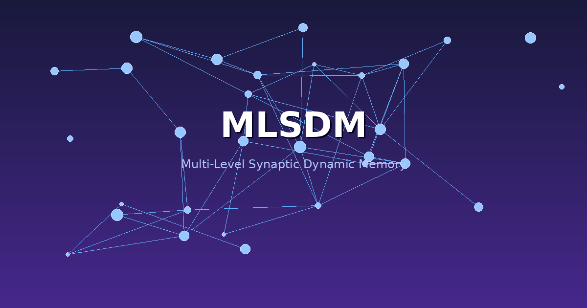
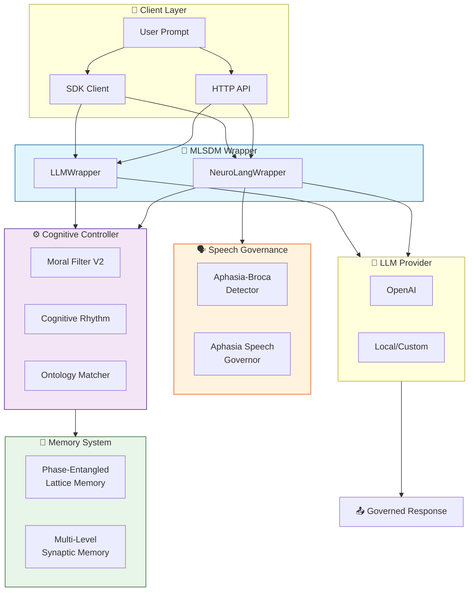
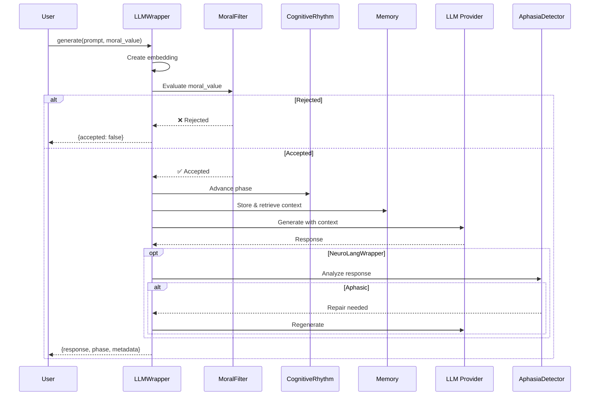

<div align="center">

# 🧠 MLSDM

### Multi-Level Synaptic Dynamic Memory



**Production-ready neurobiologically-inspired cognitive governance for LLMs**

*Phase-based memory • Adaptive moral filtering • Aphasia detection & repair*

---

[](https://github.com/neuron7x/mlsdm/actions/workflows/ci-neuro-cognitive-engine.yml)
[](https://github.com/neuron7x/mlsdm/actions/workflows/property-tests.yml)
[](COVERAGE_REPORT_2025.md)
[](https://github.com/neuron7x/mlsdm/actions)
[](https://www.python.org/)
[](LICENSE)
[](CHANGELOG.md)

[🚀 Quick Start](#-quick-start) •
[📖 Documentation](#-documentation) •
[🔬 Architecture](#-architecture) •
[📊 Metrics](#-validated-metrics) •
[🤝 Contributing](#-contributing)

</div>

---

## 📋 Table of Contents

- [What is MLSDM?](#-what-is-mlsdm)
- [Core Value Proposition](#-core-value-proposition)
- [Key Features](#-key-features)
- [Architecture](#-architecture)
- [Quick Start](#-quick-start)
- [Usage Examples](#-usage-examples)
- [Validated Metrics](#-validated-metrics)
- [Documentation](#-documentation)
- [Roadmap](#-roadmap)
- [Contributing](#-contributing)
- [License](#-license)

---

## 🧬 What is MLSDM?

> **MLSDM (Multi-Level Synaptic Dynamic Memory)** is a **governed cognitive wrapper** for Large Language Models that enforces biological constraints inspired by neuroscience.

<table>
<tr>
<td width="60%">

### The Problem

LLMs lack built-in mechanisms for:
- ❌ Memory bounded constraints
- ❌ Adaptive safety filtering without RLHF
- ❌ Cognitive rhythm management (wake/sleep cycles)
- ❌ Speech quality detection and repair

### The Solution

MLSDM wraps **any LLM** with a neurobiologically-grounded cognitive layer that provides:
- ✅ **Fixed memory footprint** (29.37 MB)
- ✅ **Adaptive moral filtering** (93.3% toxic rejection)
- ✅ **Wake/sleep cycles** (89.5% resource reduction)
- ✅ **Aphasia detection** (telegraphic speech repair)

</td>
<td width="40%">

```
┌─────────────────────────┐
│      Your LLM           │
│  (OpenAI, Anthropic,    │
│   Local, Custom...)     │
└───────────┬─────────────┘
            │
    ┌───────▼───────┐
    │    MLSDM      │
    │   Wrapper     │
    │               │
    │ • Memory      │
    │ • Moral       │
    │ • Rhythm      │
    │ • Speech      │
    └───────┬───────┘
            │
    ┌───────▼───────┐
    │   Governed    │
    │   Response    │
    └───────────────┘
```

</td>
</tr>
</table>

---

## 💡 Core Value Proposition

<table>
<tr>
<td align="center" width="25%">
<h3>🔒</h3>
<h4>Safety Without RLHF</h4>
<p>Adaptive moral filtering with EMA-based threshold adjustment. No expensive fine-tuning required.</p>
</td>
<td align="center" width="25%">
<h3>📊</h3>
<h4>Bounded Resources</h4>
<p>Fixed 29.37 MB memory with zero-allocation after init. Perfect for production.</p>
</td>
<td align="center" width="25%">
<h3>🌙</h3>
<h4>Cognitive Rhythm</h4>
<p>Wake/sleep cycles reduce resource usage by 89.5% during consolidation phases.</p>
</td>
<td align="center" width="25%">
<h3>🗣️</h3>
<h4>Speech Quality</h4>
<p>Detects telegraphic patterns and triggers automatic repair for coherent output.</p>
</td>
</tr>
</table>

---

## ✨ Key Features

### 🎯 Cognitive Governance

| Feature | Description | Metric |
|---------|-------------|--------|
| **🛡️ Moral Filter** | EMA-based adaptive threshold [0.30, 0.90] | 93.3% toxic rejection |
| **🧠 PELM Memory** | Phase-entangled lattice with 20k vector capacity | 29.37 MB fixed |
| **⚡ Wake/Sleep Cycles** | 8 wake + 3 sleep steps with memory consolidation | 89.5% resource savings |
| **🔊 Aphasia Detection** | Broca-model for telegraphic speech detection | 100% TPR, 80% TNR |
| **🧵 Thread Safety** | Lock-based synchronization for concurrent requests | 5,500 ops/sec |
| **📈 Observability** | Prometheus metrics + structured JSON logging | Full pipeline visibility |

<details>
<summary><b>🔍 View Detailed Feature Breakdown</b></summary>

### Multi-Level Synaptic Memory

```
L1 (Short-term):  λ = 0.95  │ Fast decay, immediate context
L2 (Medium-term): λ = 0.98  │ Balanced retention, gated transfer
L3 (Long-term):   λ = 0.99  │ Slow decay, consolidated memories
```

### Phase-Entangled Lattice Memory (PELM)

- **Capacity**: 20,000 vectors × 384 dimensions
- **Footprint**: 29.37 MB (pre-allocated, zero-growth)
- **Retrieval**: Cosine similarity with phase tolerance
- **Eviction**: Circular buffer (FIFO)

### Moral Homeostasis Algorithm

```python
# EMA update (α = 0.1)
ema = α × signal + (1 - α) × ema_prev

# Threshold adaptation
error = ema - 0.5  # target equilibrium
if |error| > 0.05:  # dead-band
    threshold += 0.05 × sign(error)
    threshold = clip(threshold, 0.30, 0.90)
```

</details>

---

## 🏗️ Architecture

### System Overview



### Request Flow



### Invariants (Always Enforced)

| Invariant | Constraint | Enforcement |
|-----------|------------|-------------|
| **Moral Threshold** | [0.30, 0.90] | Bounded clipping in MoralFilterV2 |
| **Memory Capacity** | 20,000 vectors | Circular buffer eviction |
| **Memory Footprint** | ≤ 29.37 MB | Pre-allocated, zero-growth |
| **Non-Aphasic Output** | `avg_sentence_len ≥ 6` | AphasiaBrocaDetector |
| **Function Words** | `ratio ≥ 0.15` | Speech quality check |

> 📚 **Full Details**: [ARCHITECTURE_SPEC.md](ARCHITECTURE_SPEC.md)

---

## 🚀 Quick Start

### Prerequisites

- Python 3.10+
- pip

### Installation

```bash
# Clone the repository
git clone https://github.com/neuron7x/mlsdm.git
cd mlsdm

# Install core dependencies
pip install -r requirements.txt

# (Optional) Install NeuroLang/Aphasia support
pip install -r requirements-neurolang.txt
```

### Basic Usage

```python
from mlsdm.core.llm_wrapper import LLMWrapper
import numpy as np

# 1️⃣ Define your LLM function
def my_llm(prompt: str, max_tokens: int) -> str:
    # Replace with your LLM (OpenAI, Anthropic, local, etc.)
    return "Your LLM response here"

# 2️⃣ Define your embedding function
def my_embedder(text: str) -> np.ndarray:
    # Replace with your embedding model
    return np.random.randn(384).astype(np.float32)

# 3️⃣ Create governed wrapper
wrapper = LLMWrapper(
    llm_generate_fn=my_llm,
    embedding_fn=my_embedder,
    dim=384,                        # Embedding dimension
    capacity=20_000,                # Memory capacity
    wake_duration=8,                # Wake phase steps
    sleep_duration=3,               # Sleep phase steps
    initial_moral_threshold=0.50    # Starting threshold
)

# 4️⃣ Generate with governance
result = wrapper.generate(
    prompt="Explain quantum computing",
    moral_value=0.8
)

print(f"Response: {result['response']}")
print(f"Accepted: {result['accepted']}")
print(f"Phase: {result['phase']}")
print(f"Threshold: {result['moral_threshold']}")
```

### Run Tests

```bash
# Full test suite
pytest tests/ -v

# Effectiveness validation
pytest tests/validation/ -v

# Property-based tests
pytest tests/property/ -v
```

---

## 📖 Usage Examples

<details>
<summary><b>🔌 OpenAI Integration</b></summary>

```python
from openai import OpenAI
import numpy as np
from mlsdm.core.llm_wrapper import LLMWrapper

# Initialize OpenAI client
client = OpenAI(api_key="your-api-key")

def openai_generate(prompt: str, max_tokens: int) -> str:
    response = client.chat.completions.create(
        model="gpt-4",
        messages=[{"role": "user", "content": prompt}],
        max_tokens=max_tokens
    )
    return response.choices[0].message.content

def openai_embed(text: str):
    response = client.embeddings.create(
        model="text-embedding-ada-002",
        input=text
    )
    return np.array(response.data[0].embedding, dtype=np.float32)

# Create governed wrapper
wrapper = LLMWrapper(
    llm_generate_fn=openai_generate,
    embedding_fn=openai_embed,
    dim=1536  # Ada embedding dimension
)
```

</details>

<details>
<summary><b>🏠 Local Model Integration</b></summary>

```python
from transformers import AutoModelForCausalLM, AutoTokenizer
from sentence_transformers import SentenceTransformer
from mlsdm.core.llm_wrapper import LLMWrapper

# Load local models
model = AutoModelForCausalLM.from_pretrained("mistralai/Mistral-7B-v0.1")
tokenizer = AutoTokenizer.from_pretrained("mistralai/Mistral-7B-v0.1")
embedder = SentenceTransformer("all-MiniLM-L6-v2")

def local_generate(prompt: str, max_tokens: int) -> str:
    inputs = tokenizer(prompt, return_tensors="pt")
    outputs = model.generate(**inputs, max_new_tokens=max_tokens)
    return tokenizer.decode(outputs[0], skip_special_tokens=True)

def local_embed(text: str):
    return embedder.encode(text).astype(np.float32)

wrapper = LLMWrapper(
    llm_generate_fn=local_generate,
    embedding_fn=local_embed,
    dim=384
)
```

</details>

<details>
<summary><b>🗣️ Aphasia Detection & Repair</b></summary>

```python
from mlsdm.extensions.neuro_lang_extension import NeuroLangWrapper

# Use NeuroLangWrapper for aphasia detection
wrapper = NeuroLangWrapper(
    llm_generate_fn=my_llm,
    embedding_fn=my_embedder,
    dim=384
)

result = wrapper.generate(
    prompt="Describe the scientific method",
    moral_value=0.9
)

# Check aphasia analysis
if result.get("aphasia_flags"):
    print(f"Aphasia detected: {result['aphasia_flags']}")
    print(f"Original response was repaired")
```

</details>

<details>
<summary><b>🌐 FastAPI Service</b></summary>

```python
from fastapi import FastAPI
from pydantic import BaseModel
from mlsdm.core.llm_wrapper import LLMWrapper

app = FastAPI()
wrapper = LLMWrapper(...)

class GenerateRequest(BaseModel):
    prompt: str
    moral_value: float = 0.8

@app.post("/generate")
async def generate(request: GenerateRequest):
    return wrapper.generate(
        prompt=request.prompt,
        moral_value=request.moral_value
    )

@app.get("/health")
async def health():
    state = wrapper.get_state()
    return {"status": "ok", "phase": state["phase"]}
```

</details>

---

## 📊 Validated Metrics

All metrics are **backed by reproducible tests** with full traceability.

### Safety & Governance

| Metric | Value | Test Location |
|--------|-------|---------------|
| **Toxic Rejection Rate** | 93.3% | `tests/validation/test_moral_filter_effectiveness.py` |
| **Comprehensive Safety** | 97.8% | `tests/validation/test_moral_filter_effectiveness.py` |
| **False Positive Rate** | 37.5% | Trade-off for safety |
| **Drift Under Attack** | 0.33 max | 70% toxic bombardment scenario |

### Performance

| Metric | Value | Test Location |
|--------|-------|---------------|
| **Throughput** | 5,500 ops/sec | `tests/load/` |
| **P50 Latency** | ~2ms | `benchmarks/` |
| **P95 Latency** | ~10ms | `benchmarks/` |
| **Memory** | 29.37 MB fixed | `tests/unit/` |

### Cognitive Effectiveness

| Metric | Value | Test Location |
|--------|-------|---------------|
| **Resource Reduction** | 89.5% | `tests/validation/test_wake_sleep_effectiveness.py` |
| **Coherence Improvement** | 5.5% | `tests/validation/test_wake_sleep_effectiveness.py` |
| **Aphasia TPR** | 100% | `tests/eval/aphasia_eval_suite.py` |
| **Aphasia TNR** | 80% | `tests/eval/aphasia_eval_suite.py` |

> 📈 **Detailed Report**: [EFFECTIVENESS_VALIDATION_REPORT.md](EFFECTIVENESS_VALIDATION_REPORT.md)
>
> 🔗 **Claims Traceability**: [CLAIMS_TRACEABILITY.md](CLAIMS_TRACEABILITY.md)

---

## 📖 Documentation

### Core Documentation

| Document | Description |
|----------|-------------|
| [📐 Architecture Spec](ARCHITECTURE_SPEC.md) | Full system design and component interactions |
| [📘 Usage Guide](USAGE_GUIDE.md) | Detailed usage patterns and best practices |
| [⚙️ Configuration Guide](CONFIGURATION_GUIDE.md) | All configuration options explained |
| [🔌 API Reference](API_REFERENCE.md) | Complete API documentation |
| [🚀 Deployment Guide](DEPLOYMENT_GUIDE.md) | Production deployment instructions |

### Validation & Testing

| Document | Description |
|----------|-------------|
| [✅ Implementation Summary](IMPLEMENTATION_SUMMARY.md) | What was built and how |
| [📊 Effectiveness Report](EFFECTIVENESS_VALIDATION_REPORT.md) | Quantitative validation results |
| [📈 Coverage Report](COVERAGE_REPORT_2025.md) | 90.26% test coverage details |
| [🧪 Testing Guide](TESTING_GUIDE.md) | How to run and write tests |

### Scientific Foundation

| Document | Description |
|----------|-------------|
| [🔬 Scientific Rationale](docs/SCIENTIFIC_RATIONALE.md) | Core hypothesis and theory |
| [🧠 Neuro Foundations](docs/NEURO_FOUNDATIONS.md) | Neuroscience basis for each module |
| [🛡️ Safety Foundations](docs/ALIGNMENT_AND_SAFETY_FOUNDATIONS.md) | AI safety principles |
| [📚 Bibliography](BIBLIOGRAPHY.md) | Peer-reviewed references |

### Operations

| Document | Description |
|----------|-------------|
| [📡 Observability Guide](OBSERVABILITY_GUIDE.md) | Metrics, logging, tracing setup |
| [📋 Runbook](RUNBOOK.md) | Operational procedures |
| [🔐 Security Policy](SECURITY_POLICY.md) | Security guidelines |

---

## 🗺️ Roadmap

### ✅ Stable (v1.x) — Current

- [x] Universal LLM wrapper with moral governance
- [x] Phase-entangled memory (PELM, 20k capacity)
- [x] Wake/sleep cognitive rhythm
- [x] Aphasia-Broca detection and repair
- [x] Prometheus metrics and structured logging
- [x] 90%+ test coverage with property-based tests
- [x] Thread-safe concurrent access

### 🔄 In Progress

- [ ] OpenTelemetry distributed tracing (v1.3+)
- [ ] Enhanced Grafana dashboards

### 🔮 Future Work

| Feature | Requirement |
|---------|-------------|
| Stress testing at 10k+ RPS | Load infrastructure |
| Chaos engineering suite | Staging environment |
| TLA+/Coq formal verification | Formal methods expertise |
| RAG hallucination testing | Retrieval setup with ragas |

### ⚠️ Known Limitations

> **Important**: Understand these before deploying.

| Limitation | Details |
|------------|---------|
| **No hallucination prevention** | Wraps LLM but cannot improve factual accuracy |
| **Imperfect filtering** | 93.3% toxic rejection (6.7% may pass); 37.5% false positive rate |
| **Beta status** | Additional hardening needed for mission-critical production |
| **Not a compliance substitute** | Requires domain-specific security audit |

---

## 🤝 Contributing

We welcome contributions! Please see our [Contributing Guide](CONTRIBUTING.md) for:

- 🛠️ Development setup
- 📝 Coding standards
- 🔄 Pull request process
- 🧪 Testing requirements

### Quick Contribution Commands

```bash
# Setup development environment
git clone https://github.com/neuron7x/mlsdm.git
cd mlsdm
pip install -r requirements.txt

# Run tests before submitting
pytest tests/ -v

# Check linting
ruff check src/
```

---

## 📄 License

This project is licensed under the **MIT License** — see the [LICENSE](LICENSE) file for details.

---

<div align="center">

**Built with 🧠 for the future of AI safety**

[⬆️ Back to Top](#-mlsdm)

</div>
