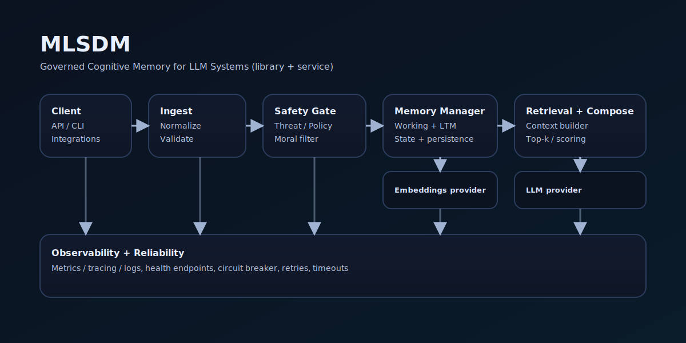

<div align="center">

# MLSDM

<picture>
  <source media="(prefers-color-scheme: dark)" srcset="assets/mlsdm-hero.svg">
  <source media="(prefers-color-scheme: light)" srcset="assets/mlsdm-hero.svg">
  
</picture>

**Governed cognitive memory for LLM systems** — library + service with safety gating, memory persistence, and observability.

</div>

## What it is
- **Library**: `LLMWrapper` adds governed generation: moral/safety gating, retrieval, retries/timeouts, circuit breaker.
- **Service**: FastAPI runtime modes for dev / local-prod / cloud-prod / agent-api.
- **Evidence-first**: reproducibility via tests and validation reports (see `CLAIMS_TRACEABILITY.md`).

## Quickstart (library)
### Install (dev)
```bash
python -m venv .venv
source .venv/bin/activate
pip install -U pip
pip install -e ".[dev]"
```

### Minimal usage

```python
import numpy as np
from mlsdm.core.llm_wrapper import LLMWrapper

def llm_generate(prompt: str, max_tokens: int) -> str:
    return f"Echo: {prompt[:80]}"

def embed(text: str) -> np.ndarray:
    return np.random.randn(384).astype(np.float32)

w = LLMWrapper(
    llm_generate_fn=llm_generate,
    embedding_fn=embed,
    dim=384,
)

out = w.generate(prompt="Explain governed memory in one paragraph.", moral_value=0.8)
print(out)
```

## Run the service

Make targets (see `Makefile`):

```bash
make run-dev
make run-cloud-local
make run-agent
make health-check
```

Runtime mode source of truth: `src/mlsdm/config/runtime.py`
Modes: `dev`, `local-prod`, `cloud-prod`, `agent-api` (via `MLSDM_RUNTIME_MODE`).

## CLI

Entry point: `mlsdm` (see `pyproject.toml`).

```bash
mlsdm --help
mlsdm info
mlsdm check
mlsdm demo
mlsdm serve
mlsdm eval --help
```

## Configuration: priorities (exact)

There are two configuration layers:

1. **RuntimeConfig** (service runtime, `src/mlsdm/config/runtime.py`)
   Priority: **ENV overrides** > **mode defaults** > **base defaults**.
   Key envs include: `MLSDM_RUNTIME_MODE`, `HOST`, `PORT`, `WORKERS`, `RELOAD`, `LOG_LEVEL`, `SECURE_MODE`, `API_KEY`, `CONFIG_PATH`.

2. **Engine config** (YAML/INI via `ConfigLoader`)
   Priority: **MLSDM_*** env overrides > **config file** > **defaults**.
   Nested overrides use double underscores, e.g. `MLSDM_MORAL_FILTER__THRESHOLD=0.7`.
   See: `CONFIGURATION_GUIDE.md`.

## Evidence / Reproducibility

* Traceability map: `CLAIMS_TRACEABILITY.md`
* Run the core gates:

```bash
make test
make lint
make type
make coverage-gate
make eval-moral_filter
```

## Docs

Start here: `DOCUMENTATION_INDEX.md`

Key docs:

* `GETTING_STARTED.md`
* `ARCHITECTURE_SPEC.md`
* `CONFIGURATION_GUIDE.md`
* `LLM_API.md`
* `OBSERVABILITY_GUIDE.md`
* `INTEGRATION_GUIDE.md`
* `DEPLOYMENT_GUIDE.md`

## Security

* Root policy: `SECURITY.md`
* Threat model & guardrails: `THREAT_MODEL.md`, `SECURITY_GUARDRAILS.md`, `SECURITY_POLICY.md`

## License

MIT — see `LICENSE`.
