# MLSDM Tools and Scripts

This document provides an overview of all utility scripts, CLI tools, and benchmarks available in the MLSDM repository.

## Table of Contents

- [Architecture Overview](#architecture-overview)
- [CLI Tool](#cli-tool)
- [Scripts](#scripts)
- [Benchmarks](#benchmarks)
- [Shell Scripts](#shell-scripts)
- [CI/CD Integration](#cicd-integration)

---

## Architecture Overview

```mermaid
flowchart TB
    subgraph CI["CI/CD Pipeline"]
        direction TB
        Lint["🔍 Lint<br/>ruff + shellcheck"]
        TypeCheck["🔎 Type Check<br/>mypy --strict"]
        Security["🔒 Security<br/>bandit + CodeQL"]
        Tests["✅ Tests<br/>pytest + bats"]
        Coverage["📊 Coverage<br/>pytest-cov"]
    end

    subgraph Scripts["Development Scripts"]
        direction TB
        EnvInit["bin/mlsdm-env.sh<br/>Environment Init"]
        CoreVerify["verify_core_implementation.sh<br/>Core Validation"]
        K8sValidate["validate-manifests.sh<br/>K8s Validation"]
    end

    subgraph Tools["Python Tools"]
        direction TB
        EffSuite["run_effectiveness_suite.py"]
        SecAudit["security_audit.py"]
        Calibration["run_calibration_benchmarks.py"]
    end

    subgraph Benchmarks["Benchmarks"]
        direction TB
        GPU["benchmark_fractal_pelm_gpu.py"]
        Memory["measure_memory_footprint.py"]
        Perf["test_neuro_engine_performance.py"]
    end

    CI --> Scripts
    CI --> Tools
    CI --> Benchmarks

    EnvInit --> |"loads"| Config["mlsdm_config.sh"]
    CoreVerify --> |"validates"| Core["src/mlsdm/*"]
    K8sValidate --> |"validates"| K8s["deploy/k8s/*"]
```



---

## CLI Tool

### `mlsdm` CLI

The main command-line interface for MLSDM.

**Installation:**
```bash
pip install -e .
```

**Commands:**

| Command | Description |
|---------|-------------|
| `mlsdm demo` | Run interactive demo of the LLM wrapper |
| `mlsdm serve` | Start the HTTP API server |
| `mlsdm check` | Check environment and configuration |

**Examples:**
```bash
# Check environment setup
mlsdm check

# Start server with default settings
mlsdm serve --host 0.0.0.0 --port 8000

# Run interactive demo
mlsdm demo --interactive

# Run demo with custom settings
mlsdm demo --prompt "Hello world" --moral-value 0.8
```

---

## Scripts

### `scripts/export_openapi.py`

Export OpenAPI specification from the FastAPI application.

**Usage:**
```bash
python scripts/export_openapi.py [--output OUTPUT_PATH] [--validate]
```

**Options:**
- `--output, -o`: Output path (default: `docs/openapi.json`)
- `--validate, -v`: Validate the generated specification
- `--no-enhance`: Don't add additional metadata

**Example:**
```bash
python scripts/export_openapi.py --output api-spec.json --validate
```

---

### `scripts/run_aphasia_eval.py`

Run the Aphasia-Broca evaluation suite to test telegraphic speech detection.

**Usage:**
```bash
python scripts/run_aphasia_eval.py [--corpus CORPUS_PATH] [--fail-on-low-metrics]
```

**Options:**
- `--corpus`: Path to aphasia corpus JSON (default: `tests/eval/aphasia_corpus.json`)
- `--fail-on-low-metrics`: Exit with error if metrics below thresholds

**Example:**
```bash
python scripts/run_aphasia_eval.py --fail-on-low-metrics
```

---

### `scripts/smoke_neurolang_wrapper.py`

Quick smoke test for the NeuroLangWrapper component.

**Usage:**
```bash
python scripts/smoke_neurolang_wrapper.py [--prompt PROMPT]
```

**Example:**
```bash
python scripts/smoke_neurolang_wrapper.py --prompt "Test the wrapper"
```

---

### `scripts/train_neurolang_grammar.py`

Train NeuroLang grammar models offline. Creates checkpoint files for production use.

**Usage:**
```bash
python scripts/train_neurolang_grammar.py [--epochs N] [--output PATH]
```

**Options:**
- `--epochs`: Number of training epochs (default: 3)
- `--output`: Output checkpoint path (default: `config/neurolang_grammar.pt`)

**⚠️ Note:** This script is blocked when `MLSDM_SECURE_MODE=1` is set.

**Example:**
```bash
python scripts/train_neurolang_grammar.py --epochs 5 --output checkpoints/grammar.pt
```

---

### `scripts/run_effectiveness_suite.py`

Run the complete effectiveness metrics suite (safety, cognition, performance).

**Usage:**
```bash
python scripts/run_effectiveness_suite.py [--output-dir DIR] [--validate-slo] [--json-only]
```

**Options:**
- `--output-dir`: Output directory for reports (default: `reports/`)
- `--validate-slo`: Validate metrics against SLO thresholds
- `--json-only`: Output JSON to stdout only

**Example:**
```bash
# Run suite and validate against SLO
python scripts/run_effectiveness_suite.py --validate-slo

# Generate JSON output for CI
python scripts/run_effectiveness_suite.py --json-only
```

---

### `scripts/run_calibration_benchmarks.py`

Run calibration experiments for MLSDM module thresholds.

**Usage:**
```bash
python scripts/run_calibration_benchmarks.py [--mode {quick,full}]
```

**Options:**
- `--mode`: Benchmark mode (default: `quick`)
  - `quick`: Fast validation with reduced iterations
  - `full`: Complete stress test

**Example:**
```bash
python scripts/run_calibration_benchmarks.py --mode full
```

---

### `scripts/generate_effectiveness_charts.py`

Generate visualization charts for effectiveness validation results.

**Usage:**
```bash
python scripts/generate_effectiveness_charts.py [--output-dir DIR]
```

**Options:**
- `--output-dir, -o`: Output directory for charts (default: `./results`)

**Requirements:** matplotlib, numpy

**Example:**
```bash
python scripts/generate_effectiveness_charts.py --output-dir ./charts
```

---

### `scripts/security_audit.py`

Run security audit including dependency vulnerability scanning.

**Usage:**
```bash
python scripts/security_audit.py [--fix] [--report PATH]
```

**Options:**
- `--fix`: Attempt to fix vulnerabilities by upgrading packages
- `--report`: Save report to file

**Example:**
```bash
python scripts/security_audit.py --report security_report.txt
```

---

### `scripts/test_security_features.py`

Integration tests for security features.

**Usage:**
```bash
python scripts/test_security_features.py
```

---

## Benchmarks

### `benchmarks/benchmark_fractal_pelm_gpu.py`

Benchmark for the experimental FractalPELMGPU memory module.

**Usage:**
```bash
python benchmarks/benchmark_fractal_pelm_gpu.py [--mode {quick,full}] [--num-vectors N] [--num-queries N]
```

**Options:**
- `--mode`: Benchmark mode (default: `quick`)
  - `quick`: 1,000 vectors, 50 queries
  - `full`: 10,000 vectors, 500 queries
- `--num-vectors`: Override number of vectors
- `--num-queries`: Override number of queries

**Requirements:** PyTorch (`pip install mlsdm[neurolang]`)

**Example:**
```bash
# Quick benchmark
python benchmarks/benchmark_fractal_pelm_gpu.py --mode quick

# Full stress test
python benchmarks/benchmark_fractal_pelm_gpu.py --mode full
```

---

### `benchmarks/measure_memory_footprint.py`

Measure and verify PELM memory footprint against documented claims.

**Usage:**
```bash
python benchmarks/measure_memory_footprint.py [--quick]
```

**Options:**
- `--quick`: Quick check for CI (verify empty PELM footprint only)

**Example:**
```bash
# Full measurement
python benchmarks/measure_memory_footprint.py

# Quick CI check
python benchmarks/measure_memory_footprint.py --quick
```

---

### `benchmarks/test_neuro_engine_performance.py`

Performance benchmarks for NeuroCognitiveEngine (runs via pytest).

**Usage:**
```bash
python -m pytest benchmarks/test_neuro_engine_performance.py -v

# Or run directly
python benchmarks/test_neuro_engine_performance.py
```

**Benchmarks:**
- Pre-flight check latency
- End-to-end latency (small load)
- End-to-end latency (heavy load with varying token counts)

---

## Shell Scripts

### `scripts/verify_core_implementation.sh`

Verify that core cognitive components are fully implemented.

**Usage:**
```bash
./scripts/verify_core_implementation.sh
```

**Checks:**
1. Test collection count
2. No TODOs or NotImplementedError in core modules

**Exit codes:**
- `0`: All checks passed
- `1`: One or more checks failed

---

### `deploy/scripts/validate-manifests.sh`

Validate Kubernetes manifests for syntax and common issues.

**Usage:**
```bash
./deploy/scripts/validate-manifests.sh [--strict]
```

**Options:**
- `--strict`: Enable strict validation with schema checking

**Requirements:**
- yq or Python with PyYAML (for YAML validation)
- kubectl (optional, for kustomize validation)
- kubeconform (optional, for schema validation)

---

### `bin/mlsdm-env.sh`

Initialize MLSDM environment by loading configuration from `mlsdm_config.sh`.

**Features:**
- Context-independent: works from any directory
- Defensive programming: validates config file thoroughly
- Cognitive feedback: clear error messages with instructions

**Setup:**
```bash
# Copy the example config
cp mlsdm_config.example.sh mlsdm_config.sh

# Edit with your settings
vim mlsdm_config.sh
```

**Usage:**
```bash
# Source the environment (from any directory)
source bin/mlsdm-env.sh

# Or run directly
./bin/mlsdm-env.sh
```

**Exit codes:**
- `0`: Configuration loaded successfully
- `1`: Configuration error (missing file, permission denied, or empty file)

---

## Exit Codes

All scripts follow standard exit code conventions:
- `0`: Success
- `1`: General error or validation failure
- Non-zero: Specific error conditions

## Environment Variables

| Variable | Description |
|----------|-------------|
| `MLSDM_SECURE_MODE` | Set to `1` to enable secure mode (blocks training scripts) |
| `CONFIG_PATH` | Path to configuration file |
| `LLM_BACKEND` | LLM backend to use (`local_stub`, `openai`) |
| `DISABLE_RATE_LIMIT` | Set to `1` to disable rate limiting |

## See Also

- [README.md](README.md) - Project overview
- [CONFIGURATION_GUIDE.md](CONFIGURATION_GUIDE.md) - Configuration options
- [TESTING_GUIDE.md](TESTING_GUIDE.md) - Testing documentation
- [DEPLOYMENT_GUIDE.md](DEPLOYMENT_GUIDE.md) - Deployment instructions

---

## CI/CD Integration

### Pre-commit Hooks

Install pre-commit hooks for automatic code quality checks:

```bash
pip install pre-commit
pre-commit install
```

Pre-commit runs automatically on `git commit` and includes:
- Trailing whitespace removal
- End-of-file fixing
- YAML/JSON validation
- Ruff linting and formatting
- ShellCheck for bash scripts
- MyPy type checking
- Bandit security scanning

### GitHub Actions

All scripts are validated in CI via GitHub Actions:

| Workflow | Checks |
|----------|--------|
| **Lint** | ruff, shellcheck, shfmt |
| **Type Check** | mypy --strict |
| **Security** | bandit, CodeQL |
| **Tests** | pytest, bats-core |
| **Coverage** | pytest-cov with badge |

### Running CI Locally

```bash
# Lint Python
ruff check scripts/ benchmarks/ --fix
ruff format scripts/ benchmarks/

# Lint Bash
shellcheck bin/*.sh scripts/*.sh deploy/scripts/*.sh

# Type check
mypy scripts/ --ignore-missing-imports

# Security scan
bandit -r scripts/ benchmarks/ -ll

# Run tests
pytest tests/scripts/ -v
```
